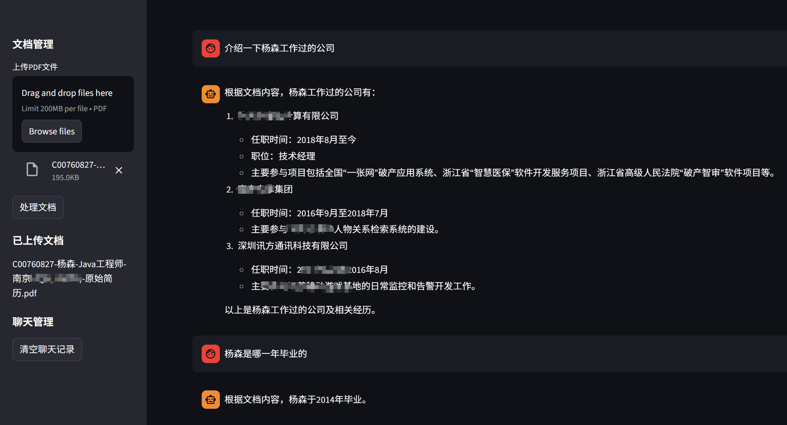

# pdf-chatbot-agent
AI PDF chatbot agent built with LangChain &amp; LangGraph,  provide multiple PDF parsing methods.
## 环境变量配置 (backend/.env.example)  修改utils下config中的env文件路径。

```shell
# ===================== ES数据库配置 =====================
ES_HOST=
ES_USER=
ES_PASSWORD=
ES_INDEX=

# ===================== LLM模型配置 =====================
LLM_API_URL=
LLM_API_KEY=
LLM_API_MODEL=

# ===================== 向量模型配置 =====================
TEXT_EMBEDDING_URL=https://****/v1/embeddings
TEXT_EMBEDDING_API_KEY=
TEXT_EMBEDDING_MODEL=

# ===================== 搜索参数配置 =====================
TOP_K=3  # 默认值3，可根据需求修改


# ===================== pdf解析服务=====================
PDF_PARSE_SERVER=
PDF_PARSE_TYPE=local  # local/server  默认值local，server表示使用服务端解析比如调用mineru或deepseek-ocr的接口，需要在pdf_processor.py中适配输出
# 本地部署deepseek-ocr参考https://blog.csdn.net/huanxingchen1/article/details/154193407?spm=1001.2014.3001.5501
```


# 应用配置
### 后台服务 API_PORT=8000  (默认)
### 运行说明
```she
1. 初始化 Elasticsearch
python scripts/init_elasticsearch.py
2. 启动后端服务
cd backend
python main.py
3. 启动前端应用
cd frontend
streamlit run app.py

```

### 4. 使用流程
1. 在前端上传 PDF 文档
2. 等待文档处理完成
3. 在聊天框中输入问题
4. 查看 AI 生成的回答及引用来源
